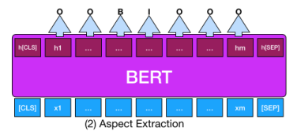
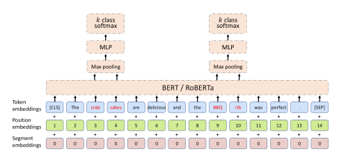
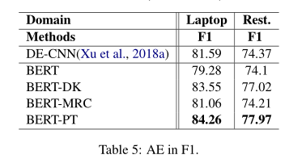
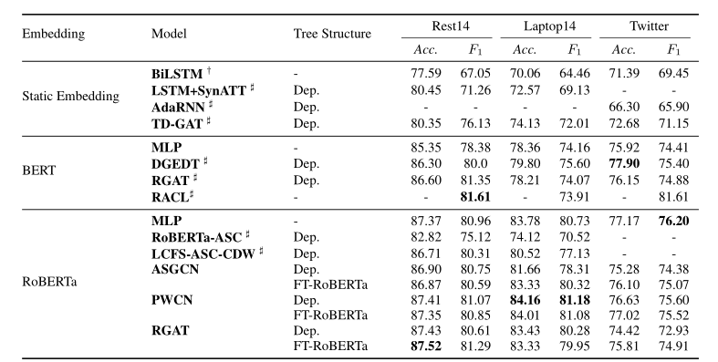

# my-absa
My reimplementation of Aspect Terms Extraction and Aspect Sentiment Classification subtasks.

## Dataset

[SemEval-2014 Task 4](https://alt.qcri.org/semeval2014/task4/)

### Example

```json
{"id": "3121", "text": ["But", "the", "staff", "was", "so", "horrible", "to", "us", "."], "aspects": [["staff", 2, 2, 3]], "label": ["O", "O", "B", "O", "O", "O", "O", "O", "O"]}
```

## Evaluation

### ATE subtask

* F1
* Accuracy

Evaluation scripts are modified based on the standard evalution scripts of SemEval-2014 Task 4. Only exactly matched terms are considered as true positive samples.

The model which gets the best weighted F1 in token classification on validation set is used for evaluation.

### ASC subtask

* F1
* Accuracy

The model which gets the best macro F1 in ASC on validation set is used for evaluation.

### Overall task

* F1

Only exactly matched terms are included in ASC subtasks.

## Models

My reimplementations of Aspect Terms Extraction(ATE) and Aspect Sentiment Classification(ASC) subtasks  is mainly based on Roberta.

### ATE subtask

Roberta[^2] for token classification.



### ASC subtask

Roberta + MLP for classifying given terms.



All of results are performed based on Roberta-base.

## Results

| Tasks   | Macro F1 | Accuracy |
| ------- | -------- | -------- |
| ATE     | 0.8345   | 0.8602   |
| ASC     | 0.7947   | 0.8307   |
| Overall | 0.7824   | 0.8240   |

The results are evaluated on SemEval-2014 Task 4 Laptop.

### Results in references

#### ATE[^1]



#### ASC[^3]



### Analysis

1. Due to the powerful representation capability of the PTM, fine-tuning converges in a small number of epochs.
2. One of the more important challenges in ABSA is the imbalance in the number of labels. Specifically, for the ATE task, the model is prone to misclassify sentences with no tags at all (Therefore, results on Restaurant are better than those on Laptop since there are more sentencees without terms). For the ASC task, the model is not precise enough to judge neutrality.

### Problems

Although the ASC model performed close to the level of the paper on Laptop, it did not successfully reproduce the original paper level on Restaurant.

## Lessons Learned

1. The tokenizer of Roberta is based on a byte-level BPE, which is different from BERT's WordPiece. For example, `'Hello'` and `' Hello'` are differently encoded in RobertaTokenizer.  This can seriously affect the performance of the model when the input words are already split by spaces. Speical handling are performed to add a space for the word in the middle of the sentence.
2. Loss on validation set is not a good indicator in specific tasks since it is not consistent with the performance of F1 and accuracy.

## Future Works

* ATE subtask
  * BERT post-training.
* ASC subtask
  * Induced dependency trees from finetuned Roberta.
  * ASC models based on dependency trees.

## References

- [^1]: Xu H, Liu B, Shu L, et al. BERT post-training for review reading comprehension and aspect-based sentiment analysis[J]. arXiv preprint arXiv:1904.02232, 2019.

- [^2]: Liu Y, Ott M, Goyal N, et al. Roberta: A robustly optimized bert pretraining approach[J]. arXiv preprint arXiv:1907.11692, 2019.

- [^3]: Dai J, Yan H, Sun T, et al. Does syntax matter? a strong baseline for aspect-based sentiment analysis with roberta[J]. arXiv preprint arXiv:2104.04986, 2021.

